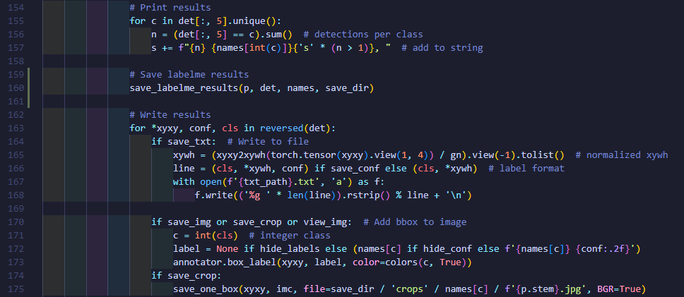
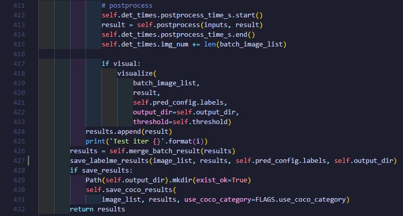

# labelme 自动标注

使用模型对数据集进行自动标注。[👉效果](https://www.bilibili.com/video/BV1R24y1f7Gu)

<table>
    <tr>
        <td>
            
        </td>
        <td>
            
        </td>
    </tr>
</table>

## 使用方法

### YOLOv5

&emsp;&emsp;将`save_labelme_results`复制到`yolov5/detect.py`中，运行`detect.py`，即可自动标注。

### PaddleDetection

&emsp;&emsp;将`save_labelme_results`复制到`PaddleDetection/deploy/python/infer.py`中，运行`deploy/python/infer.py`，即可自动标注。

